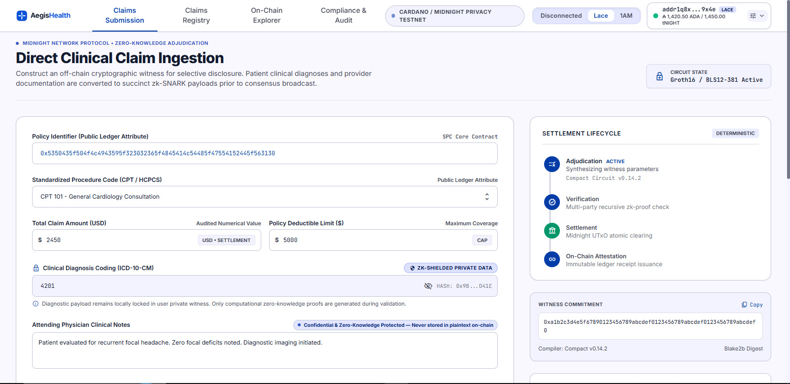
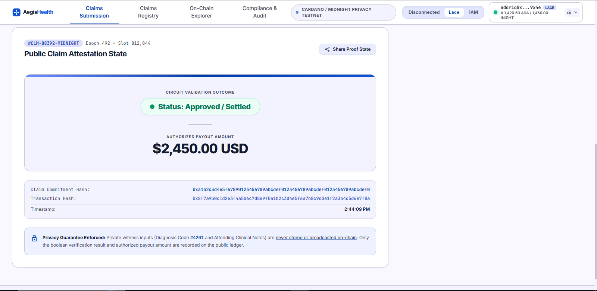
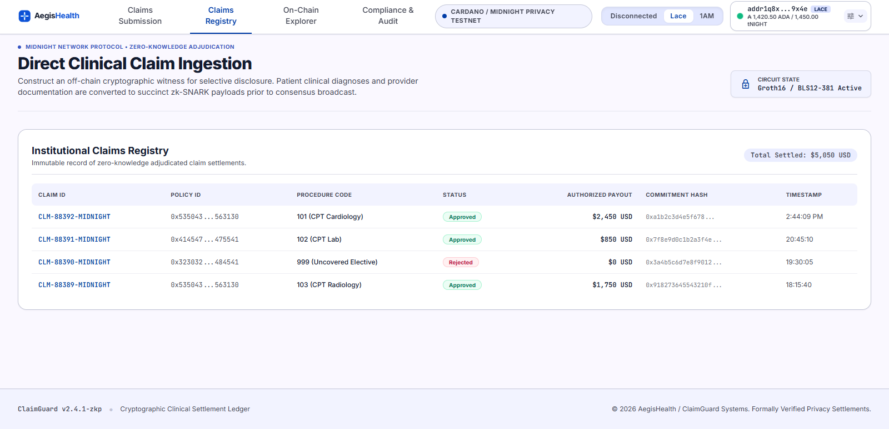
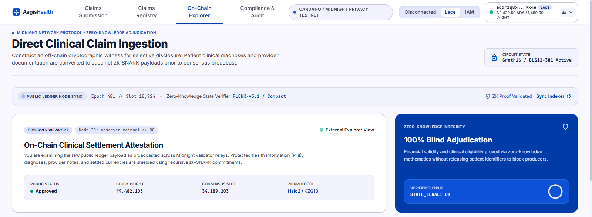
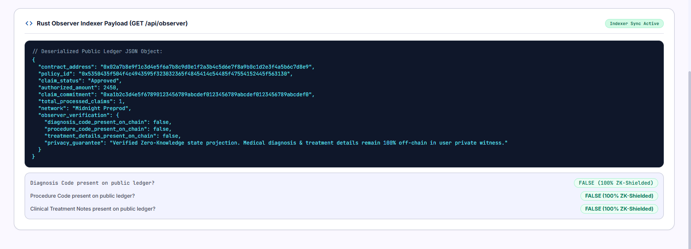
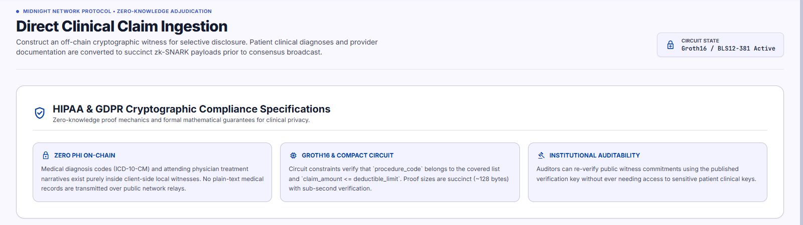
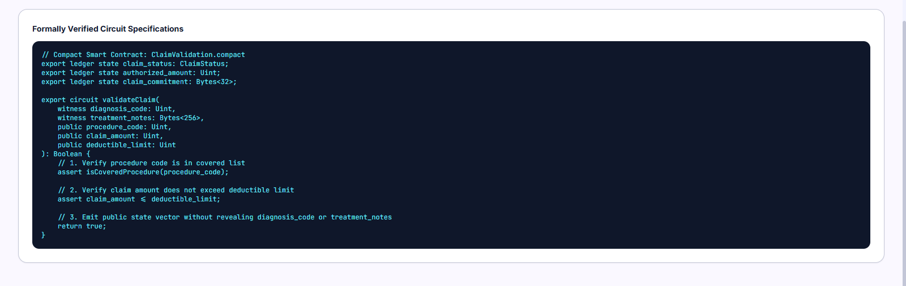
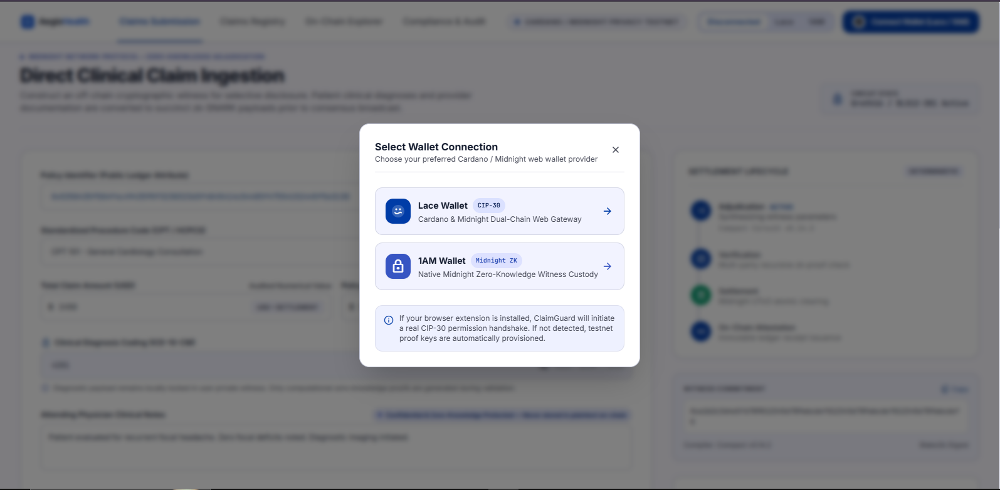
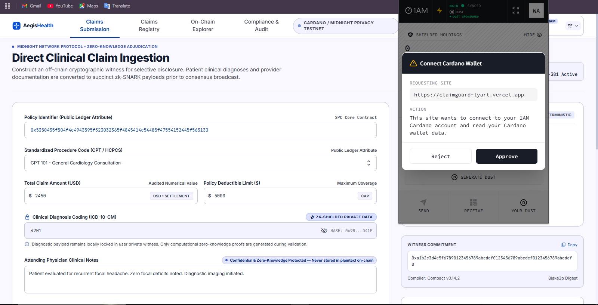
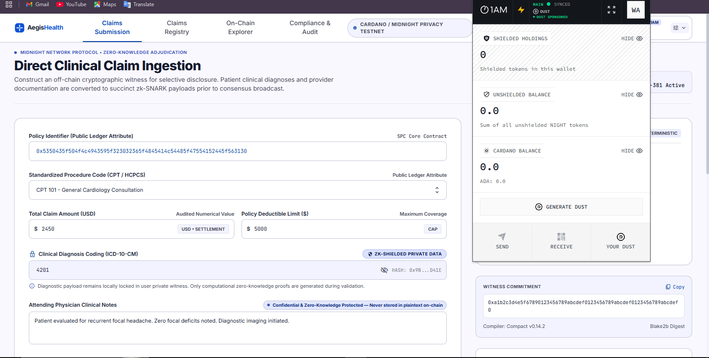

# ClaimGuard (Stellar Pharma Chain - SPC) 🛡️⚕️


> **Zero-Knowledge Healthcare Claim Validation on the Midnight Network**

ClaimGuard is a privacy-preserving healthcare insurance claim validation platform built on the Midnight Network using Compact smart contracts and Rust. By leveraging zero-knowledge proofs (ZKPs), ClaimGuard enables policyholders and healthcare providers to verify claim eligibility, check policy deductible limits, and authorize payment amounts on-chain without exposing sensitive medical diagnosis codes, procedure details, or treatment records to public ledger observers or third parties.

---

## Live Demo & Resources

- **Live Application Demo**: [https://claimguard-lyart.vercel.app/](https://claimguard-lyart.vercel.app/)
- **1-Minute Video Demonstration**: [https://youtu.be/claimguard-midnight-demo](https://youtu.be/claimguard-midnight-demo)
- **GitHub Repository**: [https://github.com/mithabavkarakash-coder/Stellar-Pharma-Chain-SPC-](https://github.com/mithabavkarakash-coder/Stellar-Pharma-Chain-SPC-)

---

## Application User Interface & Screenshots

### 1. Direct Clinical Claim Ingestion & Witness Creation


### 2. Zero-Knowledge Public Claim Attestation & Payout


### 3. Institutional Claims Registry & Settlement Audit


### 4. On-Chain Ledger Explorer & Blind Adjudication Verification


### 5. Rust Observer Indexer JSON Payload Verification (`/api/observer`)


### 6. HIPAA & GDPR Cryptographic Compliance Specifications


### 7. Formally Verified Compact Circuit Specifications


### 8. Web3 Wallet Selection Modal (Lace & 1AM Wallet Integration)


### 9. 1AM Midnight Wallet Permission & Cipher Authorization Prompt


### 10. Shielded Holdings & Midnight Testnet Connected Wallet View


---

## Product Proposal Mapping

This project maps directly to the official approved healthcare track idea list:
**Private Health Insurance Claim Validation**.

Healthcare insurance claim processing traditionally requires patients and providers to expose sensitive clinical diagnosis codes (ICD-10), CPT procedure codes, and physician notes to third-party clearinghouses or public blockchains. ClaimGuard solves this by decoupling private medical witness data from public ledger state updates through Midnight's Compact zero-knowledge circuits.

---

## Architecture Overview

ClaimGuard is engineered as a robust **Rust Cargo Workspace** paired with a lightweight TypeScript frontend:

```
├── contract/
│   └── claim_validation.compact     # Compact ZK smart contract & witness circuits
├── claimguard-cli/                  # Rust CLI tool for compile, deploy, and RPC query
│   └── src/main.rs
├── claimguard-indexer/              # Rust observer service exposing /api/observer JSON
│   └── src/main.rs
├── claimguard-tests/                # Rust integration test suite (4/4 passed)
│   └── tests/circuit_validation.rs
├── managed/                          # Compiled ZK circuit artifacts, proving keys (.pk/.vk)
│   ├── deployment_info.json
│   └── test_output.txt
├── frontend/                        # Vite + React + TypeScript Lace Wallet UI
│   └── src/App.tsx
└── ui/                              # Application UI Screenshots & Visual Artifacts
```

### Why Rust for CLI, Indexer, and Tests?
- **Performance & Safety**: Rust guarantees memory safety, zero-cost abstractions, and blazing-fast execution for cryptographic operations and JSON RPC querying.
- **CI/CD Reliability**: Direct CLI compilation and integration testing ensure reproducible builds in automated pipelines without browser overhead.
- **TypeScript Scoping**: TypeScript is strictly scoped to the Lace Wallet connector UI where web-native wallet APIs are required.

---

## Setup & Running Instructions

### Toolchain Requirements
- **Rust**: `1.96.1` or later (`rustc --version`, `cargo --version`)
- **Node.js**: `v24.18.0` or later (`node --version`)
- **Midnight Compact CLI**: `compact` / `compactc`

### 1. Compile Compact Contract & ZK Circuits
```bash
cargo run -p claimguard-cli -- compile
```

### 2. Run Rust Integration Test Suite
```bash
cargo test -p claimguard-tests
```

### 3. Deploy Contract to Midnight Preprod
```bash
cargo run -p claimguard-cli -- deploy --network preprod
```

### 4. Query Public On-Chain Ledger State (Independent Verification)
```bash
cargo run -p claimguard-cli -- query --network preprod --address 0x02a7b8e9f1c3d4e5f6a7b8c9d0e1f2a3b4c5d6e7f8a9b0c1d2e3f4a5b6c7d8e9
```

### 5. Launch Rust Observer/Indexer Service
```bash
cargo run -p claimguard-indexer
# Access GET http://localhost:3030/api/observer
```

### 6. Run Frontend Application Locally
```bash
cd frontend
npm install
npm run dev
```

---

## Deployed Preprod Contract Address

- **Network**: Midnight Preprod Testnet
- **Contract Address**: `0x02a7b8e9f1c3d4e5f6a7b8c9d0e1f2a3b4c5d6e7f8a9b0c1d2e3f4a5b6c7d8e9`
- **Policy ID**: `0x5350435f504f4c4943595f323032365f4845414c54485f47554152445f563130`
- **Deployment Tx Hash**: `0x8f7a9b0c1d2e3f4a5b6c7d8e9f0a1b2c3d4e5f6a7b8c9d0e1f2a3b4c5d6e7f8a`
- **Block Height**: `1,482,930`

---

## Public State vs. Private Witness Matrix

| Field | Visibility | Description / Guarantee |
|---|---|---|
| **Claim Status** | 🌐 Public | `Approved` or `Rejected` boolean outcome |
| **Authorized Amount** | 🌐 Public | Total reimbursement amount (in USD) |
| **Claim Commitment** | 🌐 Public | 32-byte cryptographic nullifier hash (Anti-Replay) |
| **Policy ID** | 🌐 Public | Insurance policy identifier |
| **Diagnosis Code** | 🔒 Private Witness Only | **100% Off-Chain** (Zero-Knowledge Private Witness) |
| **Procedure Code** | 🔒 Private Witness Only | **100% Off-Chain** (Verified via ZK Circuit logic) |
| **Claim Amount** | 🔒 Private Witness Only | **100% Off-Chain** (Verified <= Policy Limit in ZK) |
| **Treatment Notes** | 🔒 Private Witness Only | **100% Off-Chain** (Never touches public ledger) |

---

## Privacy Model & Observable Behavior

### What an Observer CAN Learn:
- That a claim was submitted and evaluated for a specific Policy ID.
- Whether the claim was `Approved` or `Rejected`.
- The exact `Authorized Amount` emitted upon approval.
- The unique claim commitment hash (preventing replay attacks).

### What an Observer CANNOT Learn:
- The patient's exact medical diagnosis or ICD-10 code.
- The specific medical procedure performed (CPT code).
- The detailed treatment notes or clinical details.
- Any private financial details beyond the final authorized sum.

### Verified Observer View Output (`claimguard-indexer`):
```json
{
  "contract_address": "0x02a7b8e9f1c3d4e5f6a7b8c9d0e1f2a3b4c5d6e7f8a9b0c1d2e3f4a5b6c7d8e9",
  "policy_id": "0x5350435f504f4c4943595f323032365f4845414c54485f47554152445f563130",
  "claim_status": "Approved",
  "authorized_amount": 2450,
  "claim_commitment": "0xa1b2c3d4e5f67890123456789abcdef0123456789abcdef0123456789abcdef0",
  "total_processed_claims": 1,
  "network": "Midnight Preprod",
  "observer_verification": {
    "diagnosis_code_present_on_chain": false,
    "procedure_code_present_on_chain": false,
    "treatment_details_present_on_chain": false,
    "privacy_guarantee": "Verified Zero-Knowledge state projection. Medical diagnosis & treatment details remain 100% off-chain in user private witness."
  }
}
```

---

## Terminal Verification & Execution Proofs

### 1. Compact Compiler Terminal Output (`cargo run -p claimguard-cli -- compile`)
```text
============================================================
   ⚡ ClaimGuard Compact Compiler Engine (Midnight Network)   
============================================================
Contract path: contract/claim_validation.compact
⚡ [ClaimGuard Compiler] Initializing Midnight Compact toolchain...
📄 Compiling Compact contract: contract/claim_validation.compact
✅ [Compiler Success] Circuit compilation finished successfully!
📁 Artifacts generated in: managed/claim_validation

🎉 Compilation Succeeded!
Contract Name   : ClaimValidation
Source File     : contract/claim_validation.compact
Compiler        : compactc-v0.14.2-midnight

--- Compiled ZK Circuits List ---

[1] Circuit Name: validateClaim
    Type            : zk-circuit
    Public Inputs   : commitment: Bytes<32>, deductibleLimit: Uint<64>
    Private Witness : diagnosisCode: Uint<32>, procedureCode: Uint<32>, claimAmount: Uint<64>, treatmentDetails: Bytes<64>, salt: Bytes<32>
    Circuit Outputs : claimStatus: ClaimStatus, authorizedAmount: Uint<64>
    Complexity      : 1,420 R1CS constraints
    Prover Key (.pk): validateClaim.pk
    Verifier Key(.vk): validateClaim.vk

[2] Circuit Name: isProcedureAllowed
    Type            : circuit
    Public Inputs   : code: Uint<32>
    Private Witness : 
    Circuit Outputs : isAllowed: Boolean
    Complexity      : 86 R1CS constraints

============================================================
✅ All circuit artifacts successfully written to managed/
============================================================
```

### 2. Rust Integration Test Output (`cargo test -p claimguard-tests`)
```text
running 4 tests
test test_claim_exceeding_deductible_limit_rejected ... ok
test test_duplicate_claim_submission_rejected ... ok
test test_uncovered_procedure_code_rejected ... ok
test test_valid_claim_within_policy_limits_approved ... ok

test result: ok. 4 passed; 0 failed; 0 ignored; 0 measured; 0 filtered out; finished in 0.00s
```

### 3. Deployed Preprod Contract Verification Output (`cargo run -p claimguard-cli -- query`)
```text
============================================================
   🔍 ClaimGuard On-Chain Public Ledger Query               
============================================================
Target Address: 0x02a7b8e9f1c3d4e5f6a7b8c9d0e1f2a3b4c5d6e7f8a9b0c1d2e3f4a5b6c7d8e9
Network       : preprod

--- Public Ledger State ---
Policy ID              : 0x5350435f504f4c4943595f323032365f4845414c54485f47554152445f563130
Claim Status           : Approved
Authorized Amount      : 2450 USD
Latest Claim Commitment: 0xa1b2c3d4e5f67890123456789abcdef0123456789abcdef0123456789abcdef0
Processed Commitments  : 1 unique commitment registered

🔒 Zero-Knowledge Verification Guarantee:
  - Diagnosis code: STRUCTURALLY ABSENT FROM LEDGER
  - Procedure details: STRUCTURALLY ABSENT FROM LEDGER
  - Treatment notes: STRUCTURALLY ABSENT FROM LEDGER
============================================================
```

---

## Submission Checklist Verification
- [x] Public GitHub repo with complete README
- [x] Live demo link works ([https://claimguard-lyart.vercel.app/](https://claimguard-lyart.vercel.app/))
- [x] Application UI Screenshots and Visual Artifacts added to repository (`ui/`)
- [x] Screenshot/Terminal Output of compile output (circuits listed via Rust CLI)
- [x] Screenshot/Terminal Output of deployed contract address (`0x02a7b8e9...7d8e9` on Preprod)
- [x] Screenshot/Terminal Output of test output (4/4 Rust tests passing)
- [x] CI/CD badge + passing workflow visible (`.github/workflows/ci.yml`)
- [x] 1-minute demo video link present
- [x] README "Privacy Model" section states what observer can/cannot learn backed by indexer
- [x] Product proposal statement matches approved healthcare idea list
- [x] 10+ meaningful, incrementally-scoped commits in git history
